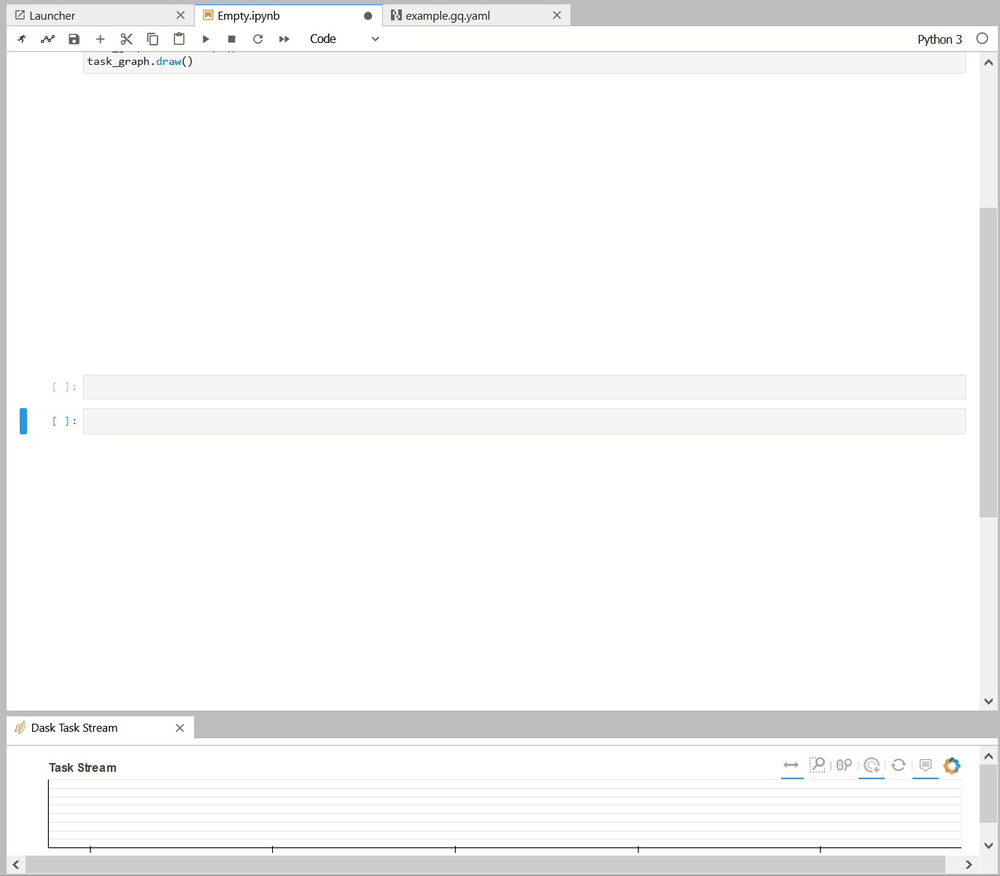

# Greenflow Plugins for FSI Examples


## What's Inside This Repo

. [plugins](plugins) - A few greenflow plugins with example notebooks. 
    1. [simple_example](plugins/simple_example) - A simple external plugin example for greenflow.
    2. [gquant_plugin](plugins/gQuant_plugin) - An external plugin with a set of nodes for quantitative analyst tasks, built on top of the [RAPIDS AI](https://rapids.ai/) project, [Numba](https://numba.pydata.org/), and [Dask](https://dask.org/).
    3. [nemo_plugin](plugins/nemo_plugin) - An external plugin with a set of nodes that wraps the [NeMo library](https://github.com/NVIDIA/NeMo) . 

These projects are all released as independent Python projects with their own `setup.py` files. 

## Screenshots




## Binary installation

### Install the gGuant 
To install the greenflow graph computation library, run:
```bash
pip install greenflow
```
Or install `greenflow` at the greenflow directory:
```bash
pip install .
```

### Install the greenflowLab JupyterLab plugin
To install `greenflowlab` JupyterLab plugin, make sure `nodejs` of version [12^14^15] is installed. E.g.:
```bash
conda install -c conda-forge nodejs=12.4.0
```
Then install the `greenflowlab`:
```bash
pip install greenflowlab
```
Or install `greenflowlab` at the greenflowlab directory:
```bash
pip install .
```

### Install the greenflow plugins

Under the plugin root directory, install the plugin as normal python packages.
```bash
pip install .
```

Note, greenflow node plugins can be registered in two ways: 

  1. (Recommended)Write a external plugin using 'entry point' to register it. Check the `plugins` directory for details
  2. Register the plugin in `greenflowrc` file. Check the `System environment` for details


## Docker Install

- Build and run the container:

```bash
$ cd greenflow/docker && . build.sh
```
When building the container, you can run greenflow in two modes: dev or prod. In the dev mode, please check the README file in `greenflowlab` directory to install the plugins and Python libraries. 

In the production mode, you can launch the container by following command and start to use it 
```bash
$ docker run --runtime=nvidia --rm -it -p 8888:8888 -p 8787:8787 -p 8786:8786 greenflow/greenflow:[tag from the build]
```

## Example notebooks

Example notebooks, tutorial showcasing, can be found in __notebooks__ folder in the plugin directory.


## System environment 

There are a few system environment that the user can overwrite. 

The custom module files are specified in the `greenflowrc` file. `GREENFLOW_CONFIG` enviroment variable points to the location of this file. By default, it points to 
`$CWD\greenflowrc`. 

In the example `greenflowrc`, system environment variable `MODULEPATH` is used to point to the paths of the module files.
To start the jupyterlab, please make sure `MODULEPATH` is set properly. 

For example, if you want to start the jupyterlab in the greenflow root directory.
```bash
MODULEPATH=$PWD/modules jupyter-lab --allow-root --ip=0.0.0.0 --no-browser --NotebookApp.token=''
```

Or, if you want to start the jupyterlab in the greenflowlab directory.
```bash
GREENFLOW_CONFIG=../greenflowrc MODULEPATH=$PWD/../modules jupyter-lab --allow-root --ip=0.0.0.0 --no-browser --NotebookApp.token=''
```
